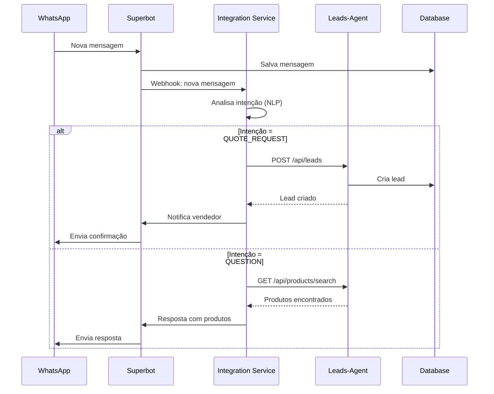
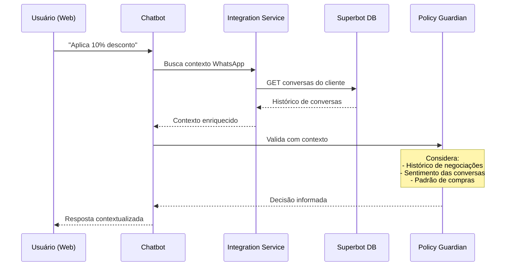

# 🤖 PLANO DE INTEGRAÇÃO: SUPERBOT → LEADS-AGENT

## Integração do Sistema de Conversas WhatsApp com o Chatbot Decisório

**Versão:** 1.0  
**Data:** 17 de Janeiro 2026  
**Status:** 📋 Planejado

---

## 📊 VISÃO GERAL

### Objetivo
Integrar as conversas gravadas do **Superbot** (sistema de WhatsApp) com o **Leads-Agent** para:
- Enriquecer o contexto do chatbot decisório com histórico de conversas
- Permitir análise de sentimento e intenções dos clientes
- Automatizar criação de leads a partir de conversas
- Fornecer insights de IA baseados em interações históricas

### Estado Atual

| Sistema | Status | Função |
|---------|--------|--------|
| **Superbot** | ✅ Operacional | Grava conversas WhatsApp no MySQL |
| **Leads-Agent** | ✅ Operacional | Gestão de leads e chatbot decisório |
| **Integração** | ❌ Inexistente | Sistemas não conectados |

---

## 🗄️ TABELAS DO SUPERBOT

### Estrutura do Banco de Dados

```
superbot_customers (1) ──────── (N) messages
                                     │
messages (1) ──────────────────── (N) message_media
                                     │
message_media (1) ─────────────── (N) message_transcriptions
                                     │
messages (1) ──────────────────── (N) message_responses
                                     │
messages (1) ──────────────────── (N) whatsapp_deliveries
```

### Descrição das Tabelas

#### 1. `messages` - Mensagens de Conversas
```sql
-- Armazena todas as mensagens trocadas via WhatsApp
- message_id: ID único da mensagem
- session_id: Sessão da conversa
- sender_phone: Telefone do remetente
- recipient_phone: Telefone do destinatário
- message_text: Conteúdo da mensagem
- source: 'user' ou 'api' (origem)
- message_type: 'text', 'media', 'status'
- direction: 'incoming' ou 'outgoing'
- status: 'received', 'processing', 'completed', 'error'
```

#### 2. `message_media` - Arquivos de Mídia
```sql
-- Arquivos anexados às mensagens
- type: 'audio', 'image', 'video', 'document'
- s3_url: URL do arquivo no S3
- transcription_status: Status da transcrição
- is_voice_note: Se é mensagem de voz
```

#### 3. `message_transcriptions` - Transcrições de Áudio
```sql
-- Transcrições geradas pelo OpenAI Whisper
- transcription_text: Texto transcrito
- confidence: Confiança da transcrição (0-1)
- language: Idioma detectado
- service_used: 'whisper' ou outro
```

#### 4. `message_responses` - Respostas da IA
```sql
-- Respostas geradas automaticamente
- ai_service: Serviço usado (OpenAI, n8n)
- raw_response: Resposta JSON completa
- formatted_response: Resposta formatada
- tokens_used: Tokens consumidos
- cost_estimate: Custo estimado
```

#### 5. `superbot_customers` - Clientes WhatsApp
```sql
-- Cadastro de clientes do WhatsApp
- jid: ID único do WhatsApp (JID)
- name: Nome
- push_name: Nome exibido no WhatsApp
- phone_number: Número de telefone
- is_group: Se é grupo
```

#### 6. `whatsapp_deliveries` - Log de Entregas
```sql
-- Rastreamento de entregas de mensagens
- delivery_type: 'log', 'response', 'product', 'transcription'
- delivery_status: 'sent', 'delivered', 'read', 'failed'
- whatsapp_message_id: ID da mensagem no WhatsApp
```

#### 7. `phone_validations` - Cache de Validações
```sql
-- Cache de validações de telefone
- phone_number: Número
- is_valid: Se é válido
- validation_api_response: Resposta da API
```

---

## 🔗 CASOS DE USO DE INTEGRAÇÃO

### 1. 📞 Identificação de Cliente por Telefone
**Fluxo:** WhatsApp → Leads-Agent
```
1. Superbot recebe mensagem de telefone X
2. Busca cliente no leads-agent por telefone
3. Se encontrado, injeta contexto do cliente
4. Chatbot responde com conhecimento do histórico
```

### 2. 📝 Criação Automática de Lead
**Fluxo:** Conversa → Lead
```
1. IA detecta intenção de compra na conversa
2. Extrai: cliente, produtos, quantidades
3. Cria lead automaticamente no sistema
4. Notifica vendedor responsável
```

### 3. 🎯 Análise de Sentimento
**Fluxo:** Histórico → Insights
```
1. Analisa últimas N conversas do cliente
2. Calcula score de sentimento
3. Identifica padrões (reclamações, elogios)
4. Alimenta dashboard de governança
```

### 4. 🔊 Transcrição → Ação
**Fluxo:** Áudio → Chatbot Decisório
```
1. Cliente envia áudio pedindo cotação
2. Whisper transcreve o áudio
3. NLP extrai intenção e entidades
4. Chatbot decisório processa a ação
```

### 5. 📊 Enriquecimento de Contexto
**Fluxo:** Histórico → Context Graph
```
1. Antes de responder, busca histórico
2. Injeta contexto de conversas anteriores
3. Policy Guardian considera histórico
4. Resposta mais personalizada
```

---

## 🏗️ ARQUITETURA PROPOSTA

### Visão Geral

```
┌─────────────────────────────────────────────────────────────────┐
│                        LEADS-AGENT                               │
│  ┌─────────────┐    ┌──────────────┐    ┌─────────────────┐    │
│  │   Frontend  │    │   Backend    │    │  Context Graph  │    │
│  │   (React)   │◄──►│  (Node.js)   │◄──►│  (CSuite)       │    │
│  └─────────────┘    └──────────────┘    └─────────────────┘    │
│                            ▲                      ▲             │
└────────────────────────────┼──────────────────────┼─────────────┘
                             │                      │
                    ┌────────┴────────┐            │
                    │  SUPERBOT       │            │
                    │  INTEGRATION    │────────────┘
                    │  SERVICE        │
                    └────────┬────────┘
                             │
┌────────────────────────────┼────────────────────────────────────┐
│                        SUPERBOT                                  │
│  ┌─────────────┐    ┌──────────────┐    ┌─────────────────┐    │
│  │  WhatsApp   │───►│  Processor   │───►│  MySQL Tables   │    │
│  │  Webhook    │    │  (n8n/Node)  │    │  (messages,etc) │    │
│  └─────────────┘    └──────────────┘    └─────────────────┘    │
└─────────────────────────────────────────────────────────────────┘
```

### Novos Componentes

```
backend/src/
├── repositories/
│   └── superbot.repository.js      # NEW: Acesso às tabelas superbot
├── services/
│   └── superbot.service.js         # NEW: Lógica de integração
├── controllers/
│   └── superbot.controller.js      # NEW: Endpoints de integração
└── routes/
    └── superbot.routes.js          # NEW: Rotas /api/superbot/*
```

---

## 📋 ENDPOINTS PROPOSTOS

### API de Integração

```
GET    /api/superbot/customers/:phone           # Buscar cliente por telefone
GET    /api/superbot/conversations/:phone       # Histórico de conversas
GET    /api/superbot/messages/:sessionId        # Mensagens de uma sessão
GET    /api/superbot/transcriptions/:phone      # Transcrições de um cliente
POST   /api/superbot/webhook                    # Webhook para novas mensagens
POST   /api/superbot/analyze-intent             # Analisar intenção de mensagem
GET    /api/superbot/stats/:phone               # Estatísticas do cliente
GET    /api/superbot/sentiment/:phone           # Análise de sentimento
```

### Exemplos de Uso

#### 1. Buscar Histórico de Conversas
```http
GET /api/superbot/conversations/5511999999999?limit=50&days=30
```

```json
{
  "success": true,
  "data": {
    "customer": {
      "jid": "5511999999999@s.whatsapp.net",
      "name": "João Silva",
      "push_name": "João"
    },
    "conversations": [
      {
        "session_id": "sess-123",
        "messages_count": 15,
        "first_message": "2026-01-15T10:00:00Z",
        "last_message": "2026-01-15T10:30:00Z",
        "has_media": true,
        "has_transcriptions": true
      }
    ],
    "stats": {
      "total_messages": 150,
      "total_sessions": 10,
      "avg_messages_per_session": 15
    }
  }
}
```

#### 2. Analisar Intenção
```http
POST /api/superbot/analyze-intent
Content-Type: application/json

{
  "phone": "5511999999999",
  "message": "Quero uma cotação de 100 rolamentos 6205"
}
```

```json
{
  "success": true,
  "data": {
    "intent": "QUOTE_REQUEST",
    "confidence": 0.95,
    "entities": {
      "quantity": 100,
      "product_search": "rolamentos 6205"
    },
    "suggested_action": "CREATE_LEAD",
    "matched_products": [
      { "id": 123, "code": "6205-2RS", "name": "Rolamento 6205 2RS" }
    ]
  }
}
```

---

## 🔄 FLUXOS DE INTEGRAÇÃO

### Fluxo 1: Mensagem → Lead Automático



### Fluxo 2: Contexto Enriquecido no Chatbot



---

## 🛠️ IMPLEMENTAÇÃO

### Fase 1: Infraestrutura (1 semana)
- [ ] Criar `superbot.repository.js` com queries básicas
- [ ] Criar `superbot.service.js` com lógica de negócio
- [ ] Criar `superbot.controller.js` com endpoints
- [ ] Configurar rotas em `superbot.routes.js`
- [ ] Adicionar documentação Swagger

### Fase 2: Busca e Consulta (1 semana)
- [ ] Endpoint: buscar cliente por telefone
- [ ] Endpoint: histórico de conversas
- [ ] Endpoint: mensagens de uma sessão
- [ ] Endpoint: estatísticas do cliente
- [ ] Cache Redis para consultas frequentes

### Fase 3: Análise de Intenção (2 semanas)
- [ ] Integrar com OpenAI para NLP
- [ ] Endpoint: analisar intenção de mensagem
- [ ] Mapeamento de intenções → ações
- [ ] Extração de entidades (produtos, quantidades)
- [ ] Matching de produtos com catálogo

### Fase 4: Criação Automática de Leads (1 semana)
- [ ] Detectar intenção de compra
- [ ] Criar lead automaticamente
- [ ] Associar cliente do leads-agent
- [ ] Notificar vendedor responsável
- [ ] Registrar origem "WhatsApp"

### Fase 5: Enriquecimento de Contexto (2 semanas)
- [ ] Integrar com Context Graph
- [ ] Injetar histórico de conversas no chatbot
- [ ] Análise de sentimento
- [ ] Padrões de comunicação
- [ ] Dashboard de insights

### Fase 6: Webhook em Tempo Real (1 semana)
- [ ] Endpoint webhook para Superbot
- [ ] Processamento assíncrono de mensagens
- [ ] Fila de mensagens (Redis/RabbitMQ)
- [ ] Retry e error handling
- [ ] Logging e monitoramento

---

## 📊 MODELO DE DADOS ESTENDIDO

### Views Propostas

```sql
-- View: Resumo de conversas por cliente
CREATE VIEW vw_superbot_customer_summary AS
SELECT 
  sc.phone_number,
  sc.name,
  sc.push_name,
  COUNT(DISTINCT m.session_id) as total_sessions,
  COUNT(m.id) as total_messages,
  SUM(CASE WHEN m.direction = 'incoming' THEN 1 ELSE 0 END) as incoming_count,
  SUM(CASE WHEN m.direction = 'outgoing' THEN 1 ELSE 0 END) as outgoing_count,
  MAX(m.received_at) as last_message_at,
  MIN(m.received_at) as first_message_at
FROM superbot_customers sc
LEFT JOIN messages m ON m.sender_phone = sc.phone_number 
                     OR m.recipient_phone = sc.phone_number
GROUP BY sc.id;

-- View: Mensagens com transcrições
CREATE VIEW vw_superbot_messages_enriched AS
SELECT 
  m.*,
  mm.type as media_type,
  mm.s3_url as media_url,
  mm.is_voice_note,
  mt.transcription_text,
  mt.confidence as transcription_confidence,
  mr.formatted_response as ai_response,
  mr.ai_service
FROM messages m
LEFT JOIN message_media mm ON mm.message_id = m.id
LEFT JOIN message_transcriptions mt ON mt.media_id = mm.id
LEFT JOIN message_responses mr ON mr.message_id = m.id;

-- View: Link superbot → leads-agent customers
CREATE VIEW vw_superbot_leads_customers AS
SELECT 
  sc.id as superbot_customer_id,
  sc.phone_number,
  sc.name as superbot_name,
  c.cCliente as leads_customer_id,
  c.xNome as leads_customer_name,
  c.xCNPJ as cnpj,
  u.id as seller_id,
  u.nick as seller_name
FROM superbot_customers sc
LEFT JOIN mak.clientes c ON 
  REPLACE(REPLACE(REPLACE(c.xFone, ' ', ''), '-', ''), '(', '') 
  LIKE CONCAT('%', RIGHT(sc.phone_number, 9), '%')
LEFT JOIN mak.users u ON u.id = c.cVendedor;
```

### Tabela de Link Proposta

```sql
-- Tabela de vinculação explícita
CREATE TABLE superbot_customer_links (
  id INT AUTO_INCREMENT PRIMARY KEY,
  superbot_customer_id INT NOT NULL,
  leads_customer_id INT NOT NULL,
  linked_by INT NULL, -- user_id que fez o link
  linked_at TIMESTAMP DEFAULT CURRENT_TIMESTAMP,
  verified BOOLEAN DEFAULT FALSE,
  
  UNIQUE KEY uk_link (superbot_customer_id, leads_customer_id),
  FOREIGN KEY (superbot_customer_id) REFERENCES superbot_customers(id),
  FOREIGN KEY (leads_customer_id) REFERENCES clientes(cCliente)
);

-- Tabela de leads originados do WhatsApp
CREATE TABLE superbot_lead_origins (
  id INT AUTO_INCREMENT PRIMARY KEY,
  lead_id INT NOT NULL, -- cSCart
  session_id VARCHAR(50) NOT NULL,
  message_id INT NULL,
  intent_detected VARCHAR(80),
  confidence DECIMAL(5,4),
  created_at TIMESTAMP DEFAULT CURRENT_TIMESTAMP,
  
  UNIQUE KEY uk_lead (lead_id),
  FOREIGN KEY (lead_id) REFERENCES sCart(cSCart),
  FOREIGN KEY (message_id) REFERENCES messages(id)
);
```

---

## 🔐 SEGURANÇA

### Considerações

1. **Autenticação**
   - Webhook autenticado via API Key
   - Endpoints protegidos por JWT existente
   - Rate limiting para prevenção de abuso

2. **Privacidade**
   - Não expor dados sensíveis de conversas
   - Mascarar números de telefone em logs
   - LGPD: consentimento para uso de dados

3. **Validação**
   - Validar telefones antes de vincular
   - Confirmar vínculo cliente manualmente
   - Audit log de todas as operações

---

## 📈 MÉTRICAS DE SUCESSO

| Métrica | Meta | Descrição |
|---------|------|-----------|
| Leads automáticos | +20% | Leads criados via WhatsApp |
| Tempo resposta | -50% | Contexto pré-carregado |
| Conversão | +15% | Melhor atendimento |
| NPS WhatsApp | >4.5 | Satisfação do cliente |

---

## ⚠️ RISCOS E MITIGAÇÕES

| Risco | Impacto | Mitigação |
|-------|---------|-----------|
| Vínculo incorreto de cliente | Alto | Validação manual + score de confiança |
| Sobrecarga de mensagens | Médio | Fila assíncrona + rate limiting |
| Falha na transcrição | Baixo | Fallback para texto + retry |
| Intenção mal detectada | Médio | Confirmação humana para ações críticas |

---

## 🚀 PRÓXIMOS PASSOS

1. **Validar com stakeholders** - Aprovar escopo de integração
2. **Setup de ambiente** - Garantir acesso às tabelas do superbot
3. **PoC básico** - Implementar busca por telefone
4. **Iterar** - Adicionar funcionalidades incrementalmente

---

## 📚 REFERÊNCIAS

- `sql/superbot.sql` - DDL das tabelas do Superbot
- `docs/CHATBOT_CONTEXT_GRAPH.md` - Arquitetura do Context Graph
- `docs/CHATBOT_CSUTE_INTEGRATION.md` - Integração com CSuite
- `docs/DDL_CHATBOT_MYSQL.sql` - DDL do Chatbot Decisório

---

**© Rolemak - Leads Agent**  
*Plano de Integração Superbot v1.0*
